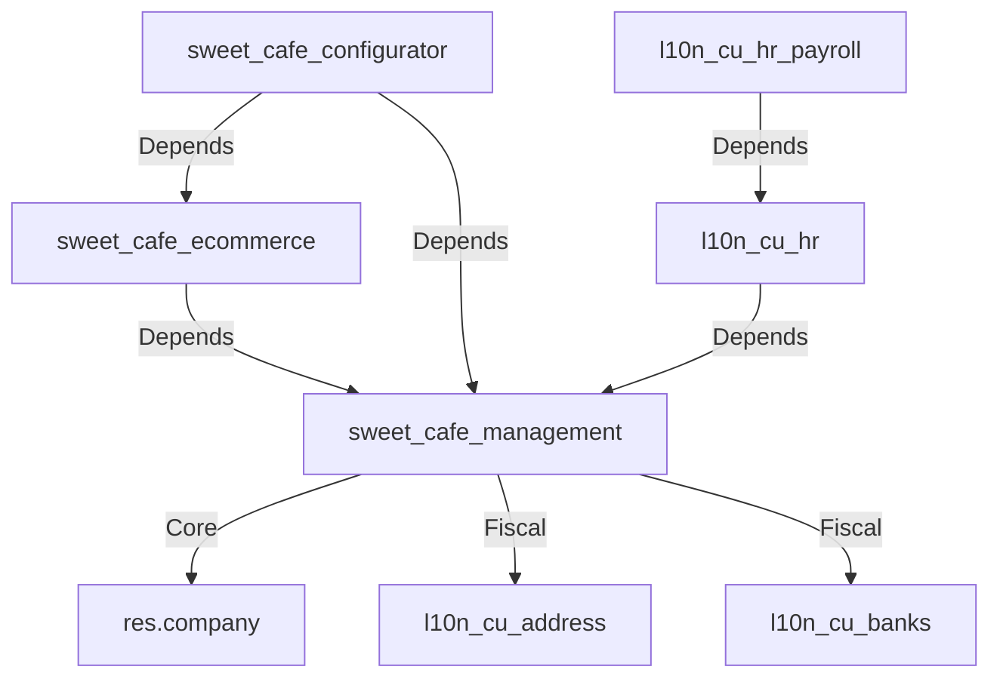

# Project Architecture - Sweet Café

## Module Dependency Graph

## Layers

1. **Odoo Base Layer (`odoo-19.0/`)**: The Odoo framework itself.
2. **Fiscal Layer (`l10n_cu_*`)**: Modules handling Cuban specific laws, provinces, and payroll.
3. **Core Business Layer (`sweet_cafe_management`)**: Extension of Odoo models for bakery specific needs (branches, bakery inventory).
4. **Interactive Layer (`sweet_cafe_configurator`)**: Frontend heavy AI tool and Fabric.js editor.
5. **QA Layer (`qa-agent/`)**: Playwright test suite for cross-browser validation.

## Standards

- **Linter**: Follow Odoo standards (Pylint Odoo).
- **Frontend**: OWL (Odoo Web Library) for native Odoo UI, Fabric.js for the custom configurator.
- **Backend**: Python 3.10+ with type hints.
